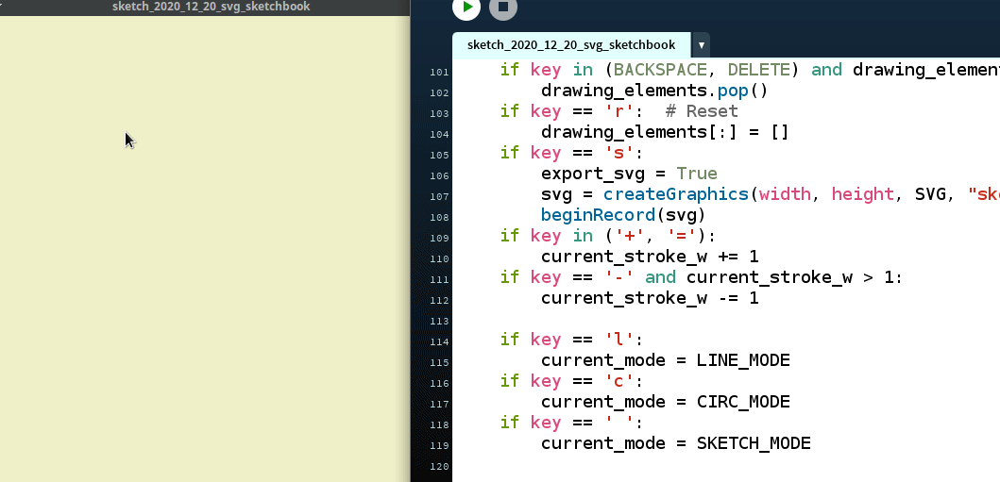

## RabiscoPad

A bare-bones SVG sketchpad - Licensed under GPL v3.0

Developed by [Alexandre B A Villares](http://twitter.com/villares) and [Foad S. Farimani](https://twitter.com/fsfarimani)

### How to run this?

- You will need [to install Processing Python Mode](https://abav.lugaralgum.com/como-instalar-o-processing-modo-python/index-EN.html)— we might provide self-contained "builds" for Linux, MacOS & Windows one day (you cold volunteer to mantain them!);
- Clone this repository or just hit [download](https://github.com/villares/rabiscopad/archive/main.zip);
- Use the Processing IDE to open the `rabiscopad.pyde` file, mind it must be kept on its folder named `rabiscopad` with its `.py` modules.

### Keyboard shortcuts:

- <kbd>s</kbd> save SVG
- <kbd>c</kbd> draw circle mode
- <kbd>l</kbd> draw line mode
- <kbd>q</kbd> draw quad/rectangle mode
- <kbd>space</kbd> free drawing mode
- <kbd>x</kbd> selection mode
- <kbd>backspace</kbd> or <kbd>delete</kbd> erase last element or selected element
- <kbd>r</kbd> erase all
- <kbd>+</kbd> and <kbd>-</kbd> change stroke weight

## Mouse Wheel

- Use the mouse wheel to rotate selected elements (when in selection mode)
- Hold <kbd>SHIFT</kbd> to scale instead
- Hold <kbd>CONTROL</kbd> to make the mouse the center of rotation/scaling

## Change log:

- v2020_12_19 exporting SVG now!
- v2020_12_20 line mode & circle mode
- v2020_12_21 first attempt at GUI Buttons
- v2020_12_22 pe/stroke color buttons
- v2020_12_24 first crude attempt at selection mode
- v2020_12_27 mode buttons, multiple key detection (to get SHIFT)
	multiple selection (with SHIFT), moving selected objects with mouse drag
- v2021_01_02 Rotate selected objects with mouse wheel SHIFT will scale,
	CONTROL to change center of rotation/scaling

---

## TODO IDEAS:

- [X] GUI buttons (can be improved a lot)
    - [X] stroke/pen colors
    - [ ] stroke weight
    - [X] drawing modes 
	
- [ ] save SVG with timestamp on name
	- [ ] save SVG to user selected file

- [ ] load & save drawing
	- HARDER: load SVG and parse elements to allow editing saved file
	- EASIER: save/load session data in a serialized file
		REALLY EASY: pickle
		I'd have to look: JSON

- [ ] modes & elements
	- [X] line
	- [X] circle
	- [X] "quad"/rectangle
	- [ ] triangle / regular polygon ?
	- [ ] polygon
	- [X] select/edit mode
		- erase selected element
		- drag mouse to move them
		- transform (**with the scroll wheel!**)
		   - rotate
		   - scale

- [ ] snapping
	- to grid / ruler
	- to objects (possibly very hard)

- [ ] other features:
	- import image - maybe hard
	- export raster image (PNG) - easy peasy
	- import / open SVG (hard if you want to edit things, easy otherwise)
	- layers (maybe hard)
	- zoom and pan (maybe hard...)
	- change background
	- resize the window (maybe nasty)
	
- [ ] two-key keyboard shortcuts (a bit of trouble)
	- <kbd>cmd/ctrl + s</kbd> --> save
	- <kbd>cmd/ctrl + z</kbd> --> undo (maybe hard, but I had some ideas...)
	- <kbd>cmd/ctrl + r</kbd> --> redo (see above)
	- <kbd>cmd/ctrl + d</kbd> --> duplicate selected / last drawn 
	

